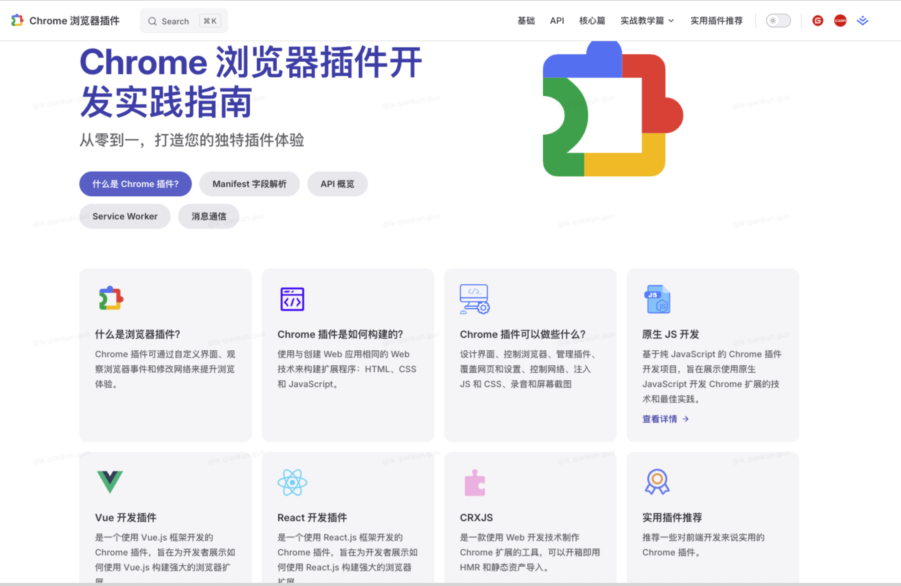

# Chrome 浏览器插件开发实践指南

本文是一份针对想要学习Chrome浏览器插件开发的开发者的详尽指南。从Chrome插件的基本概念和架构开始，到实际的插件开发流程和常见问题的解决方案，本文将提供全面的教程和实践经验，帮助读者快速掌握Chrome插件开发的技能，并构建出功能丰富、高效实用的插件。

## 首页

## 模块
主要分为以下几个模块

### 1. 基础篇

- 插件概览
- 插件术语
- `Manifest` 文件字段解析

### 2. 核心篇

- `Service Worker`
- `Content Script`
- `Action`
- `Permissions`
- `Match Patterns`
- 消息通信

### 3. API 篇

- `API` 概览
- `chrome.action`
- `chrome.scripting`
- `chrome.commands`
- `chrome.cookies`
- `chrome.permissions`
- `chrome.runtime`
- `chrome.storage`
- `chrome.tabs`

### 4. 实战教学篇

- 原生 `JS` 开发
- `Vue`
- `React`
- `CRXJS Vue`
- `CRXJS React`

### 5. 总结篇

- `V3` 版本网络请求
- `V2` 升级至 `V3`
- 插件打包发布
- 开发过程问题集
- 实用插件推荐

### 6. 插件实战篇源码

[gitee 项目地址](https://gitee.com/guoqiankun/my-vue3-plugin/tree/react_vite_chrome/)
[CSDN 文章地址](https://guoqiankun.blog.csdn.net/?type=blog)
[掘金 文章地址](https://juejin.cn/user/2409752520033768/posts)

